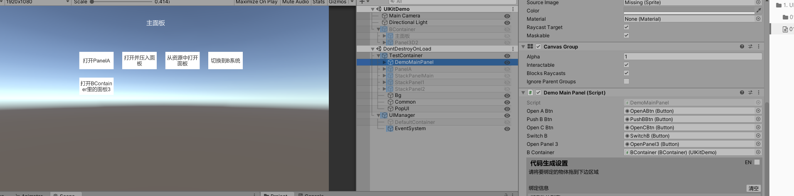
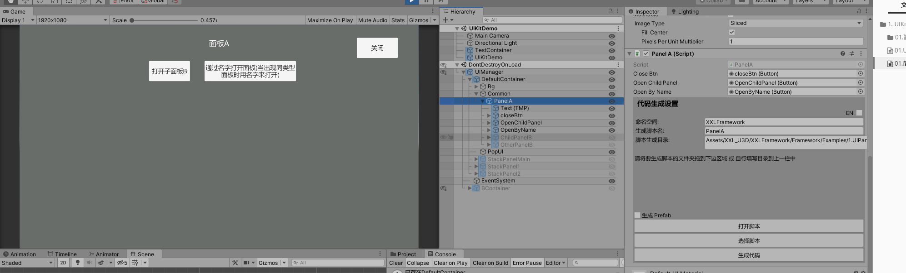
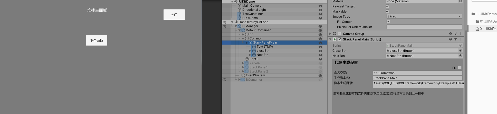

# 01. UIKitDemo

# DemoMainPanel

* 五个按钮依次测试的功能是打开容器下存在的Panel, 打开并将Panel压入到堆栈, 从资源中加载Panel, 切换到另一个容器，打开其他容器里的Panel



```csharp
using UnityEngine;
using UnityEngine.UI;
using TMPro;

namespace XXLFramework
{
	public class DemoMainPanelData : BasePanelData
	{
	}
	public partial class DemoMainPanel : BasePanel
	{
		public PanelContainer BContainer;


		private void Start()
		{
			// please add init code here
			UIKit.AddContainer(BContainer);
			OpenABtn.onClick.AddListener(() => { UIKit.OpenPanel<PanelA>(); });
			PushBBtn.onClick.AddListener(() => { CloseSelf(); UIKit.PushPanel<StackPanelMain>(); });
			OpenCBtn.onClick.AddListener(() => { UIKit.OpenPanel<HandlePanel>(PanelLevel.PopUI, new HandlePanelData() { Content = "测试一下从资源中加载面板" }); });
			SwitchB.onClick.AddListener(() => { UIKit.ChangeContainer<BContainer>(); });
		}

		protected override void OnInit(IPanelData uiData = null)
		{
			DemoMainPanelData data = uiData as DemoMainPanelData ?? new DemoMainPanelData();
			// 当需要用到外部数据初始化Panel时在此初始化
		}
		
		protected override void OnOpen(IPanelData uiData = null)
		{
		}
		
		protected override void OnClose(bool destroy)
		{
		}
	}
}

```


# PanelA

* 如果面板下有多个相同类型的子面板，用This.OpenPanel<T>(string gameObjName);  gameObjName表示子面板的名字
* 


```csharp
using UnityEngine;
using UnityEngine.UI;
using TMPro;

namespace XXLFramework
{
	public class PanelAData : BasePanelData
	{
	}
	public partial class PanelA : BasePanel
	{
		private void Start()
		{
			// please add init code here
			closeBtn.onClick.AddListener(()=>CloseSelf());
			OpenChildPanel.onClick.AddListener(() => { UIkit.OpenPanel<ChildPanelB>(); });
			OpenByName.onClick.AddListener(() => { this.OpenPanel<ChildPanelB>("OtherPanelB"); });
		}

		protected override void OnInit(IPanelData uiData = null)
		{
			PanelAData data = uiData as PanelAData ?? new PanelAData();
			// 当需要用到外部数据初始化Panel时在此初始化
		}
		
		protected override void OnOpen(IPanelData uiData = null)
		{
		}
		
		protected override void OnClose(bool destroy)
		{
		}
	}
}

```


# StackPanelMain

* 1、测试堆栈面板 : 在项目开发中，经常遇到需要返回到上一面板的情况，如果遇到这种情况，那么打开面板后用UIKit.PushPanel入栈，那么当需要返回到上一面板时调用UIKit.Back就能关闭当前Panel，并打开上一个入栈的Panel。
* 


```csharp
using UnityEngine;
using UnityEngine.UI;
using TMPro;

namespace XXLFramework
{
	public class StackPanelMainData : BasePanelData
	{
	}
	public partial class StackPanelMain : BasePanel
	{
		private void Start()
		{
			// please add init code here
			closeBtn.onClick.AddListener(()=> { UIKit.PopPanel(); UIKit.OpenPanel<DemoMainPanel>(PanelLevel.Bg); });
			NextBtn.onClick.AddListener(() => 
			{
				CloseSelf();
				UIKit.PushPanel<StackPanel1>();
			});
		}
		
		protected override void OnInit(IPanelData uiData = null)
		{
			StackPanelMainData data = uiData as StackPanelMainData ?? new StackPanelMainData();
			// 当需要用到外部数据初始化Panel时在此初始化
		}
		
		protected override void OnOpen(IPanelData uiData = null)
		{
		}
		
		protected override void OnClose(bool destroy)
		{
		}
	}
}

```


```csharp
using UnityEngine;
using UnityEngine.UI;
using TMPro;

namespace XXLFramework
{
	public class StackPanel1Data : BasePanelData
	{
	}
	public partial class StackPanel1 : BasePanel
	{
		private void Start()
		{
			// please add init code here
			backBtn.onClick.AddListener(UIKit.PopPanel);
			NextBtn.onClick.AddListener(() => 
			{
				CloseSelf();
				UIKit.PushPanel<StackPanel2>();
			});
		}
		
		protected override void OnInit(IPanelData uiData = null)
		{
			StackPanel1Data data = uiData as StackPanel1Data ?? new StackPanel1Data();
			// 当需要用到外部数据初始化Panel时在此初始化
		}
		
		protected override void OnOpen(IPanelData uiData = null)
		{
		}
		
		protected override void OnClose(bool destroy)
		{
		}
	}
}

```


```csharp
using UnityEngine;
using UnityEngine.UI;
using TMPro;

namespace XXLFramework
{
	public class StackPanel2Data : BasePanelData
	{
	}
	public partial class StackPanel2 : BasePanel
	{
		private void Start()
		{
			// please add init code here
			backBtn.onClick.AddListener(UIKit.PopPanel);
		}
		
		protected override void OnInit(IPanelData uiData = null)
		{
			StackPanel2Data data = uiData as StackPanel2Data ?? new StackPanel2Data();
			// 当需要用到外部数据初始化Panel时在此初始化
		}
		
		protected override void OnOpen(IPanelData uiData = null)
		{
		}
		
		protected override void OnClose(bool destroy)
		{
		}
	}
}

```


# 切换不同的容器

* 当遇到需要有多个系统切换的时候，而这两个系统需要互不干扰的情况下，请使用UIKit.ChangeContainer,则会切换到对应的Container,不同容器之间的逻辑互不干扰，比如游戏中的主系统和副本系统


