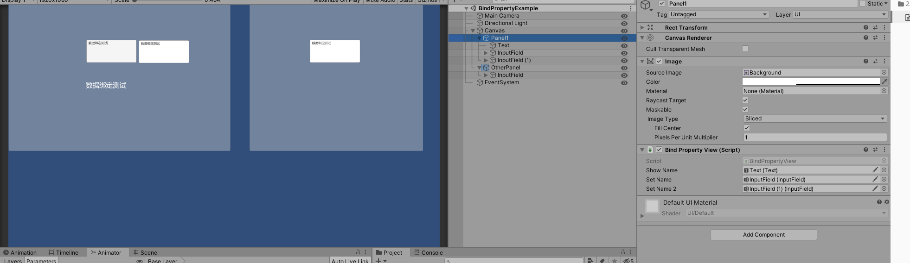

# BindPropertyDemo



* 用BindProperty实现数据绑定，测试代码如下

  ## Architecture

## Model

``` csharp
namespace XXLFramework
{
	public class BindPropertyDemoModel : AbstractModel
	{
        public  BindableProperty<string> Name;

        public BindPropertyDemoModel(string name)
        {
            Name = new BindableProperty<string>(name);
        }

        protected override void OnInit()
		{
			//初始化

		}

	}
}

```

## View1

``` csharp
using UnityEngine.UI;
using UnityEngine;
using XXLFramework;

public class BindPropertyView : MonoBehaviour
{
    public Text showName;
    public InputField setName;
    public InputField setName2;

    BindPropertyDemoModel testModel;

	private void Awake()
	{
        GameArchitecture.Interface.RegisterModel(new BindPropertyDemoModel());
    }

	private void Start()
    {
        // 数据绑定用法
        testModel = this.GetModel<BindPropertyDemoModel>();
        testModel.Name.RegisterWithInitValue(value => { showName.text = value; });
        testModel.Name.RegisterWithInitValue(value => { setName.text = value; });
        testModel.Name.RegisterWithInitValue(value => { setName2.text = value; });

        setName.onValueChanged.AddListener(content => testModel.Name.Value = content);
        setName2.onEndEdit.AddListener(content => testModel.Name.Value = content);
    }


}

```

## View2

``` csharp
using UnityEngine;
using UnityEngine.UI;

namespace XXLFramework
{
    public class OtherPropertyPanel : MonoBehaviour, IController
    {
        public InputField setName;

		// Start is called before the first frame update测试
		void Start()
        {
            BindPropertyDemoModel testModel = this.GetModel<BindPropertyDemoModel>();
            testModel.Name.RegisterWithInitValue(value => { setName.text = value; });

            setName.onValueChanged.AddListener(content => testModel.Name.Value = content);
        }

        public IArchitecture GetArchitecture()
        {
            return BindPropertyDemoArchitecture.Interface;
        }

    }
}

```

