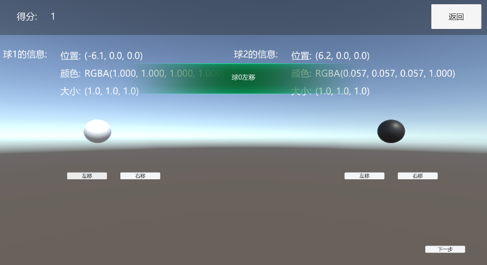
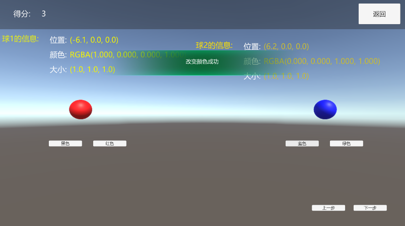
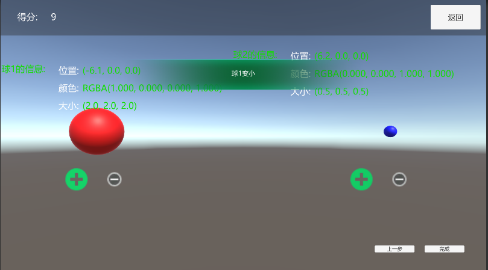

# 综合demo

## demo中应用了UIKit中的堆栈，数据绑定和架构中的数据共享，命令和事件的应用








``` csharp
using UnityEngine;
using UnityEngine.UI;

namespace XXLFramework
{
    public class DemoEntry : MonoBehaviour
    {
        // Start is called before the first frame update测试
        void Start()
        {
            UIKit.OpenPanel<FirstPagePanel>();
        }

    }
}

```


``` csharp
namespace XXLFramework
{
	public class ScoreModel : AbstractModel
	{
		public BindableProperty<int> Score;

		protected override void OnInit()
		{
			//初始化
			Score = new BindableProperty<int>(0);
		}

		public void AddScore(int addScore) 
		{
			Score.Value += addScore;
		}
	}
}

```

``` csharp
using System.Collections;
using System.Collections.Generic;
using UnityEngine;

namespace XXLFramework
{
	public class SphereInfoModel : AbstractModel
	{
		public int Index; //索引
		public BindableProperty<Vector3> Pos;
		public BindableProperty<Color> SphereColor;
		public BindableProperty<Vector3> Scale;


		public SphereInfoModel(int index, Vector3 pos, Color color, Vector3 scale)
		{
			this.Index = index;
			Pos = new BindableProperty<Vector3>(pos);
			SphereColor = new BindableProperty<Color>(color);
			Scale = new BindableProperty<Vector3>(scale);
		}


		protected override void OnInit()
		{
			//初始化

		}
	}
}

```

``` csharp
using System.Collections.Generic;
using UnityEngine;

namespace XXLFramework
{
	public class SphereSystem : AbstractSystem
	{
		public List<SphereInfoModel> Models;
		protected override void OnInit()
		{
			//初始化
			Models = new List<SphereInfoModel>();
		}

		public void Add(SphereInfoModel model) 
		{
			Models.Add(model);
		}

		public SphereInfoModel Get(int index)
		{
			foreach (var item in Models)
			{
				if (item.Index==index)
				{
					return item;
				}
			}
			Debug.Log($"不存在索引为{index}的球的信息");
			return null;
		}
	}
}

```

``` csharp
using UnityEngine;
using UnityEngine.UI;
using TMPro;
using XXLFramework.Binding;

namespace XXLFramework
{
	public class FirstPagePanelData : BasePanelData
	{
	}
	public partial class FirstPagePanel : BasePanel
	{
		private void Start()
		{
			// please add init code here
			btn1.onClick.AddListener(OnBtn1Click);
		}

		private void OnBtn1Click()
		{
			CloseSelf();
			BasePanel panel = UIKit.OpenPanel<PagePanel1>();
			UIKit.PushPanel(panel);
		}

		protected override void OnInit(IPanelData uiData = null)
		{
			FirstPagePanelData data = uiData as FirstPagePanelData ?? new FirstPagePanelData();
			// 当需要用到外部数据初始化Panel时在此初始化
		}

		protected override void OnOpen(IPanelData uiData = null)
		{
		}

		protected override void OnClose(bool destroy)
		{
		}

	}
}

```

``` csharp
using UnityEngine;
using XXLFramework;

namespace XXLFramework
{
	public partial class TopDemo : ViewController
	{
		private void Start()
		{
			// please add init code here
			returnBtn.onClick.AddListener(OnReturn);
			BindScoreInfo();
		}
		private void BindScoreInfo()
		{
			ScoreModel model = this.GetModel<ScoreModel>();
			model.Score.RegisterWithInitValue(s => ScoreTxt.text = s.ToString()).UnRegisterWhenGameObjectDestroyed(gameObject);
		}

		private void OnReturn()
		{
			this.SendCommand(new HandleHintCmd("确定返回首页吗？", () => 
			{
				UIKit.CloseAllPanel();
				UIKit.OpenPanel<FirstPagePanel>();
			}));
		}

	}
}

```

``` csharp
using UnityEngine;
using UnityEngine.UI;
using TMPro;
using System;
using XXLFramework.Binding;

namespace XXLFramework
{
	public class PagePanel1Data : BasePanelData
	{
	}
	public partial class PagePanel1 : BasePanel
	{

		private void Start()
		{
			// please add init code here
			leftMoveBtn0.onClick.AddListener(()=>this.SendEvent(new LeftMoveEvent(0)));
			rightMoveBtn0.onClick.AddListener(() => this.SendEvent(new RightMoveEvent(0)));
			leftMoveBtn1.onClick.AddListener(() => this.SendEvent(new LeftMoveEvent(1)));
			rightMoveBtn1.onClick.AddListener(() => this.SendEvent(new RightMoveEvent(1)));
			NextBtn.onClick.AddListener(OnNext);
			BindSpereInfo();
		}

		private void BindSpereInfo()
		{
			SphereSystem sphereSystem = this.GetSystem<SphereSystem>();
			sphereSystem.Get(0).Pos.RegisterWithInitValue(p => posTxt0.text = p.ToString()).UnRegisterWhenGameObjectDestroyed(gameObject);
			sphereSystem.Get(0).SphereColor.RegisterWithInitValue(c => colorTxt0.text = c.ToString()).UnRegisterWhenGameObjectDestroyed(gameObject);
			sphereSystem.Get(0).Scale.RegisterWithInitValue(s => scaleTxt0.text = s.ToString()).UnRegisterWhenGameObjectDestroyed(gameObject);

			sphereSystem.Get(1).Pos.RegisterWithInitValue(p => posTxt1.text = p.ToString()).UnRegisterWhenGameObjectDestroyed(gameObject);
			sphereSystem.Get(1).SphereColor.RegisterWithInitValue(c => colorTxt1.text = c.ToString()).UnRegisterWhenGameObjectDestroyed(gameObject);
			sphereSystem.Get(1).Scale.RegisterWithInitValue(s => scaleTxt1.text = s.ToString()).UnRegisterWhenGameObjectDestroyed(gameObject);
		}

		private void OnNext()
		{
			CloseSelf();
			UIKit.PushPanel<PagePanel2>();
		}


		protected override void OnInit(IPanelData uiData = null)
		{
			PagePanel1Data data = uiData as PagePanel1Data ?? new PagePanel1Data();
			// 当需要用到外部数据初始化Panel时在此初始化
		}
		
		protected override void OnOpen(IPanelData uiData = null)
		{
		}
		
		protected override void OnClose(bool destroy)
		{
		}
	}

	internal struct LeftMoveEvent
	{
		public int SphereIndex;
		public LeftMoveEvent(int index) { SphereIndex = index; }
	}

	internal struct RightMoveEvent
	{
		public int SphereIndex;
		public RightMoveEvent(int index) { SphereIndex = index; }
	}
}

```

``` csharp
using UnityEngine;
using UnityEngine.UI;
using TMPro;
using System;
using XXLFramework.Binding;

namespace XXLFramework
{
	public class PagePanel2Data : BasePanelData
	{
	}
	public partial class PagePanel2 : BasePanel
	{

		private void Start()
		{
			// please add init code here
			blackBtn.onClick.AddListener(()=>this.SendCommand(new ChangeSphereColorCmd(0,Color.black)));
			redBtn.onClick.AddListener(() => this.SendCommand(new ChangeSphereColorCmd(0, Color.red)));

			blueBtn.onClick.AddListener(() => this.SendCommand(new ChangeSphereColorCmd(1, Color.blue)));
			greenBtn.onClick.AddListener(() => this.SendCommand(new ChangeSphereColorCmd(1, Color.green)));

			lastBtn.onClick.AddListener(OnLast);
			NextBtn.onClick.AddListener(OnNext);
			BindSpereInfo();
		}

		private void OnLast()
		{
			UIKit.Back();
		}

		private void BindSpereInfo()
		{
			SphereSystem sphereSystem = this.GetSystem<SphereSystem>();
			sphereSystem.Get(0).Pos.RegisterWithInitValue(p => posTxt0.text = p.ToString()).UnRegisterWhenGameObjectDestroyed(gameObject);
			sphereSystem.Get(0).SphereColor.RegisterWithInitValue(c => colorTxt0.text = c.ToString()).UnRegisterWhenGameObjectDestroyed(gameObject);
			sphereSystem.Get(0).Scale.RegisterWithInitValue(s => scaleTxt0.text = s.ToString()).UnRegisterWhenGameObjectDestroyed(gameObject);

			sphereSystem.Get(1).Pos.RegisterWithInitValue(p => posTxt1.text = p.ToString()).UnRegisterWhenGameObjectDestroyed(gameObject);
			sphereSystem.Get(1).SphereColor.RegisterWithInitValue(c => colorTxt1.text = c.ToString()).UnRegisterWhenGameObjectDestroyed(gameObject);
			sphereSystem.Get(1).Scale.RegisterWithInitValue(s => scaleTxt1.text = s.ToString()).UnRegisterWhenGameObjectDestroyed(gameObject);
		}

		private void OnNext()
		{
			CloseSelf();
			UIKit.PushPanel<PagePanel3>();
		}

		protected override void OnInit(IPanelData uiData = null)
		{
			PagePanel1Data data = uiData as PagePanel1Data ?? new PagePanel1Data();
			// 当需要用到外部数据初始化Panel时在此初始化
		}

		protected override void OnOpen(IPanelData uiData = null)
		{
		}

		protected override void OnClose(bool destroy)
		{
		}

	}

}

```

``` csharp
using UnityEngine;
using UnityEngine.UI;
using TMPro;
using System;
using XXLFramework.Binding;

namespace XXLFramework
{
	public class PagePanel3Data : BasePanelData
	{
	}
	public partial class PagePanel3 : BasePanel
	{
		private void Start()
		{
			// please add init code here
			expandBtn0.onClick.AddListener(()=> { this.SendEvent(new SphereExpandEvent(0)); });
			lessenBtn0.onClick.AddListener(() => { this.SendEvent(new SphereLessenEvent(0)); });

			expandBtn1.onClick.AddListener(() => { this.SendEvent(new SphereExpandEvent(1)); });
			lessenBtn1.onClick.AddListener(() => { this.SendEvent(new SphereLessenEvent(1)); });

			lastBtn.onClick.AddListener(OnLast);
			finishBtn.onClick.AddListener(OnFinish);
			BindSpereInfo();
		}

		private void OnLast()
		{
			UIKit.Back();
		}

		private void BindSpereInfo()
		{
			SphereSystem sphereSystem = this.GetSystem<SphereSystem>();
			sphereSystem.Get(0).Pos.RegisterWithInitValue(p => posTxt0.text = p.ToString()).UnRegisterWhenGameObjectDestroyed(gameObject);
			sphereSystem.Get(0).SphereColor.RegisterWithInitValue(c => colorTxt0.text = c.ToString()).UnRegisterWhenGameObjectDestroyed(gameObject);
			sphereSystem.Get(0).Scale.RegisterWithInitValue(s => scaleTxt0.text = s.ToString()).UnRegisterWhenGameObjectDestroyed(gameObject);

			sphereSystem.Get(1).Pos.RegisterWithInitValue(p => posTxt1.text = p.ToString()).UnRegisterWhenGameObjectDestroyed(gameObject);
			sphereSystem.Get(1).SphereColor.RegisterWithInitValue(c => colorTxt1.text = c.ToString()).UnRegisterWhenGameObjectDestroyed(gameObject);
			sphereSystem.Get(1).Scale.RegisterWithInitValue(s => scaleTxt1.text = s.ToString()).UnRegisterWhenGameObjectDestroyed(gameObject);
		}

		private void OnFinish()
		{
			CloseSelf();
			UIKit.OpenPanel<FirstPagePanel>();
		}


		protected override void OnInit(IPanelData uiData = null)
		{
			PagePanel1Data data = uiData as PagePanel1Data ?? new PagePanel1Data();
			// 当需要用到外部数据初始化Panel时在此初始化
		}

		protected override void OnOpen(IPanelData uiData = null)
		{
		}

		protected override void OnClose(bool destroy)
		{
		}
	}

	internal struct SphereExpandEvent
	{
		public int SphereIndex;
		public SphereExpandEvent(int index) { SphereIndex = index; }
	}

	internal struct SphereLessenEvent
	{
		public int SphereIndex;
		public SphereLessenEvent(int index) { SphereIndex = index; }
	}
}

```

``` csharp
using System;
using UnityEngine;
using XXLFramework;
using XXLFramework.Binding;
using DG.Tweening;

namespace XXLFramework
{
	public partial class SphereContrl : ViewController
	{
		ScoreModel scoreModel;

		SphereSystem sphereSystem;

		private void Awake()
		{
			scoreModel = this.GetModel<ScoreModel>();
			sphereSystem = this.GetSystem<SphereSystem>();
			sphereSystem.Add(new SphereInfoModel(0, sphere0.transform.localPosition, sphere0.material.color, sphere0.transform.localScale));
			sphereSystem.Add(new SphereInfoModel(1, sphere1.transform.localPosition, sphere1.material.color, sphere1.transform.localScale));
		}

		void Start()
		{
			BindSpereInfo();
			RegisterEvent();
		}

		private void BindSpereInfo()
		{
			SphereInfoModel model0 = sphereSystem.Get(0);
			model0.SphereColor.Register(c => sphere0.material.color = c).UnRegisterWhenGameObjectDestroyed(gameObject);

			SphereInfoModel model1 = sphereSystem.Get(1);
			model1.SphereColor.Register(c => sphere1.material.color = c).UnRegisterWhenGameObjectDestroyed(gameObject);
		}

		private void RegisterEvent()
		{
			this.RegisterEvent<LeftMoveEvent>(OnLeftMove);
			this.RegisterEvent<RightMoveEvent>(OnRightMove);
			this.RegisterEvent<SphereExpandEvent>(OnExpand);
			this.RegisterEvent<SphereLessenEvent>(OnLessen);
		}

		private void OnLeftMove(LeftMoveEvent evt)
		{
			if (evt.SphereIndex==0)
			{
				sphere0.transform.DOLocalMoveX(sphere0.transform.localPosition.x - 1, 0.5f).OnComplete
				(() =>{
					scoreModel.AddScore(1);
					sphereSystem.Get(0).Pos.Value = sphere0.transform.localPosition;
				});
			}
			else if (evt.SphereIndex == 1)
			{
				sphere1.transform.DOLocalMoveX(sphere1.transform.localPosition.x - 1, 0.5f).OnComplete
				(() => {
					scoreModel.AddScore(1);
					sphereSystem.Get(1).Pos.Value = sphere1.transform.localPosition;
				});
			}
			this.SendCommand(new CommenHintCmd($"球{evt.SphereIndex}左移"));
		}

		private void OnRightMove(RightMoveEvent evt)
		{
			if (evt.SphereIndex == 0)
			{
				sphere0.transform.DOLocalMoveX(sphere0.transform.localPosition.x + 1, 0.5f).OnComplete
				(() => {
					scoreModel.AddScore(1);
					sphereSystem.Get(0).Pos.Value = sphere0.transform.localPosition;
				});
			}
			else if (evt.SphereIndex == 1)
			{
				sphere1.transform.DOLocalMoveX(sphere1.transform.localPosition.x + 1, 0.5f).OnComplete
				(() => {
					scoreModel.AddScore(1);
					sphereSystem.Get(1).Pos.Value = sphere1.transform.localPosition;
				});
			}
			this.SendCommand(new CommenHintCmd($"球{evt.SphereIndex}右移"));
		}

		private void OnExpand(SphereExpandEvent evt)
		{
			if (evt.SphereIndex==0)
			{
				Vector3 scale = sphere0.transform.localScale;
				sphere0.transform.DOScale(scale * 2, 0.5f).OnComplete
					(() =>
					{
						scoreModel.AddScore(1);
						sphereSystem.Get(0).Scale.Value = sphere0.transform.localScale;
					});
			}
			else if (evt.SphereIndex == 1)
			{
				Vector3 scale = sphere1.transform.localScale;
				sphere1.transform.DOScale(scale * 2, 0.5f).OnComplete
					(() =>
					{
						scoreModel.AddScore(1);
						sphereSystem.Get(1).Scale.Value = sphere1.transform.localScale;
					});
			}
			this.SendCommand(new CommenHintCmd($"球{evt.SphereIndex}变大"));
		}

		private void OnLessen(SphereLessenEvent evt)
		{
			if (evt.SphereIndex == 0)
			{
				Vector3 scale = sphere0.transform.localScale;
				sphere0.transform.DOScale(scale / 2, 0.5f).OnComplete
					(() =>
					{
						scoreModel.AddScore(1);
						sphereSystem.Get(0).Scale.Value = sphere0.transform.localScale;
					});
			}
			else if (evt.SphereIndex == 1)
			{
				Vector3 scale = sphere1.transform.localScale;
				sphere1.transform.DOScale(scale / 2, 0.5f).OnComplete
					(() =>
					{
						scoreModel.AddScore(1);
						sphereSystem.Get(1).Scale.Value = sphere1.transform.localScale;
					});
			}
			this.SendCommand(new CommenHintCmd($"球{evt.SphereIndex}变小"));
		}

	}
}

```

