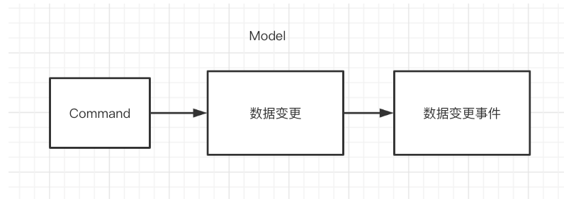
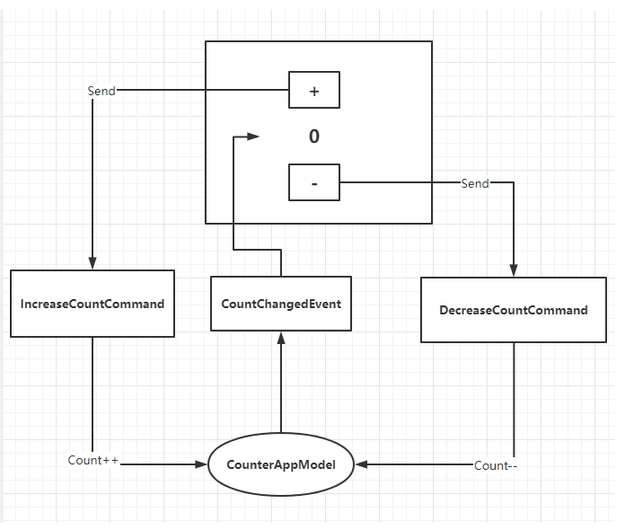
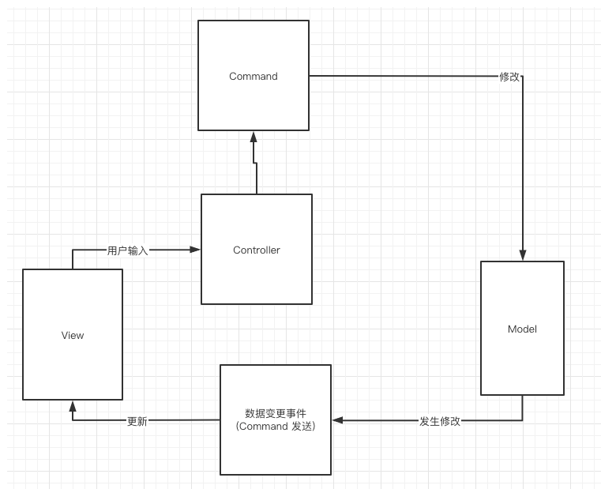

# 04. 引入 Event

我们看下当前的代码:

```csharp
using UnityEngine;
using UnityEngine.UI;

namespace XXLFramework.Example
{
    
    // 1. 定义一个 Model 对象
    public class CounterAppModel : AbstractModel
    {
        public int Count;
        
        protected override void OnInit()
        {
            Count = 0;
        }
    }

    
    // 引入 Command
    public class IncreaseCountCommand : AbstractCommand
    {
        protected override void OnExecute()
        {
            this.GetModel<CounterAppModel>().Count++;
        }
    }
    
    public class DecreaseCountCommand : AbstractCommand
    {
        protected override void OnExecute()
        {
            this.GetModel<CounterAppModel>().Count--;
        }
    }

    // Controller
    public class CounterAppController : MonoBehaviour
    {
        // View
        private Button mBtnAdd;
        private Button mBtnSub;
        private Text mCountText;
        
        // 4. Model
        private CounterAppModel mModel;

        void Start()
        {
            // 5. 获取模型
            mModel = this.GetModel<CounterAppModel>();
            
            // View 组件获取
            mBtnAdd = transform.Find("BtnAdd").GetComponent<Button>();
            mBtnSub = transform.Find("BtnSub").GetComponent<Button>();
            mCountText = transform.Find("CountText").GetComponent<Text>();
            
            
            // 监听输入
            mBtnAdd.onClick.AddListener(() =>
            {
                // 交互逻辑
                this.SendCommand<IncreaseCountCommand>();
                // 表现逻辑
                UpdateView();        
            });
            
            mBtnSub.onClick.AddListener(() =>
            {
                // 交互逻辑
                this.SendCommand<DecreaseCountCommand>();
                // 表现逻辑
                UpdateView();
            });
            
            UpdateView();
        }
        
        void UpdateView()
        {
            mCountText.text = mModel.Count.ToString();
        }


        private void OnDestroy()
        {
            // 8. 将 Model 设置为空
            mModel = null;
        }
    }
}

```


我们通过引入了 Command 来帮助 Controller 分担了一部分的交互逻辑。

但是表现逻辑的代码目前看起来并不是很智能。

表现逻辑的代码如下：

```csharp
// 监听输入
mBtnAdd.onClick.AddListener(() =>
{
    // 交互逻辑
    this.SendCommand<IncreaseCountCommand>();
    // 表现逻辑
    UpdateView();        
});
            
mBtnSub.onClick.AddListener(() =>
{
    // 交互逻辑
    this.SendCommand<DecreaseCountCommand>();
    // 表现逻辑
    UpdateView();
});
```

每次调用逻辑之后，表现逻辑部分都需要手动调用一次（UpdateView 方法）。

在一个项目中，表现逻辑的调用次数，至少会和交互逻辑的调用次数一样多。因为只要修改了数据，对应地就要把数据的biang在界面上表现出来。

而这部分嗲用表现逻辑的代码也会很多，所以我们引入一个事件机制来解决这个问题。

这个事件机制的使用其实是和 Command 一起使用的，这里有一个简单的小模式，如下图所示：



即通过 Command 修改数据，当数据发生修改后发送对应的数据变更事件。

这个是简化版本的 CQRS 原则，即 Command Query Responsibility Separiation，读写分离原则。

引入这项原则会很容易实现 事件驱动、数据驱动 架构。

在 XXLFramework 中，用法非常简单，代码如下:

```csharp
using UnityEngine;
using UnityEngine.UI;

namespace XXLFramework.Example
{
    
    // 1. 定义一个 Model 对象
    public class CounterAppModel : AbstractModel
    {
        public int Count;
        
        protected override void OnInit()
        {
            Count = 0;
        }
    }

    
    // 定义数据变更事件
    public struct CountChangeEvent // ++
    {
        
    }
    
    // 引入 Command
    public class IncreaseCountCommand : AbstractCommand 
    {
        protected override void OnExecute()
        {
            this.GetModel<CounterAppModel>().Count++;
            this.SendEvent<CountChangeEvent>(); // ++
        }
    }
    
    public class DecreaseCountCommand : AbstractCommand
    {
        protected override void OnExecute()
        {
            this.GetModel<CounterAppModel>().Count--;
            this.SendEvent<CountChangeEvent>(); // ++
        }
    }

    public class CounterAppController : MonoBehaviour
    {
        // View
        private Button mBtnAdd;
        private Button mBtnSub;
        private Text mCountText;
        
        // 4. Model
        private CounterAppModel mModel;

        void Start()
        {
            // 5. 获取模型
            mModel = this.GetModel<CounterAppModel>();
            
            // View 组件获取
            mBtnAdd = transform.Find("BtnAdd").GetComponent<Button>();
            mBtnSub = transform.Find("BtnSub").GetComponent<Button>();
            mCountText = transform.Find("CountText").GetComponent<Text>();
            
            
            // 监听输入
            mBtnAdd.onClick.AddListener(() =>
            {
                // 交互逻辑
                this.SendCommand<IncreaseCountCommand>();
            });
            
            mBtnSub.onClick.AddListener(() =>
            {
                // 交互逻辑
                this.SendCommand(new DecreaseCountCommand(/* 这里可以传参（如果有） */));
            });
            
            UpdateView();
            
            // 表现逻辑
            this.RegisterEvent<CountChangeEvent>(e =>
            {
                UpdateView();

            }).UnRegisterWhenGameObjectDestroyed(gameObject);
        }
        
        void UpdateView()
        {
            mCountText.text = mModel.Count.ToString();
        }

        private void OnDestroy()
        {
            // 8. 将 Model 设置为空
            mModel = null;
        }
    }
}
```


代码很简单。

流程图如下：



引入事件机制 和 CQRS 原则之后，我们的表现逻辑的代码变少了很多。

由原来的两次主动调用

``` csharp
// 监听输入
mBtnAdd.onClick.AddListener(() =>
{
    // 交互逻辑
    this.SendCommand<IncreaseCountCommand>(); // 没有参数构造的命令支持泛型
    // 表现逻辑
    UpdateView();
});
            
mBtnSub.onClick.AddListener(() =>
{
    // 交互逻辑
    this.SendCommand(new DecreaseCountCommand()); // 也支持直接传入对象（方便通过构造传参)
    // 表现逻辑
    UpdateView();
});
```

变成了一处监听事件，接收事件进行调用。

``` csharp
// 监听输入
mBtnAdd.onClick.AddListener(() =>
{
    // 交互逻辑
    this.SendCommand<IncreaseCountCommand>(); // 没有参数构造的命令支持泛型
});
            
mBtnSub.onClick.AddListener(() =>
{
    // 交互逻辑
    this.SendCommand(new DecreaseCountCommand()); // 也支持直接传入对象（方便通过构造传参)
});
            
UpdateView();
            
// 表现逻辑
this.RegisterEvent<CountChangeEvent>(e =>
{
    UpdateView();
}).UnRegisterWhenGameObjectDestroyed(gameObject);
```

这样减缓了很多交互逻辑。

OK，到此，我们算是用上了还算合格的 MVC 的实现，而 QFramework 所提供的概念中，最重要的概念已经接触到了，即 CQRS，通过 Command 去修改数据，数据发生修改后发送数据变更事件。

当前的示意图如下：




学到这里，对于 XXLFramework 架构的使用算是真正的入门了。

不过接下来还有一些概念，我们下一篇继续。
