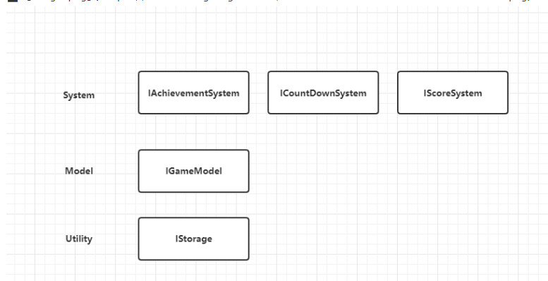

# 11. Architecture 的好处


游戏开始的时候，将项目中用到的System和Model注册到架构中并依次初始化

代码如下:
```csharp
namespace XXLFramework
{
	public class GameArchitecture : Architecture<GameArchitecture>
	{
		//主动调用初始化架构，调用此方法时会走到Init方法，将项目中所有System和Model注册到架构中并依次初始化
		public static void InitArchitecture()
		{
			IArchitecture architecture = Interface;
		}

		// 主要的初始化方法
		protected override void Init()
		{
			// 注册项目用需要用到的system和model
			//RegisterSystem(new GameSystem());
			//RegisterModel(new GameModel()); 
		}


	}
}
```

大家可能会问，如果一个项目有非常多的 System、Model、Utility 全部注册到 Architecture，这样 Architecture 的代码量就变多了，会不会让项目变得难以管理？

答案是不会，Architecture 注册的模块越多，这套架构发挥的作用就越大。

因为 Architecture 本身就能很好地展示项目的结构，可以把 Architecture 本身当做一个架构图。

比如以上伪代码对应的架构图如下：

非常清晰。

而伪代码中只有 5 个注册模块，是非常少见的，一般情况下，项目都会注册十几个甚至几十个模块，也有上百个模块的时候。

而如果这些模块没有用 XXLFramework 而全部使用单例实现的话，项目就会变得很混乱。

而使用了 XXLFramework，我们就可以在 Architecture 中统一集中管理这些模块，是方便项目管理的。

这就是使用 Architecture 的优势。

