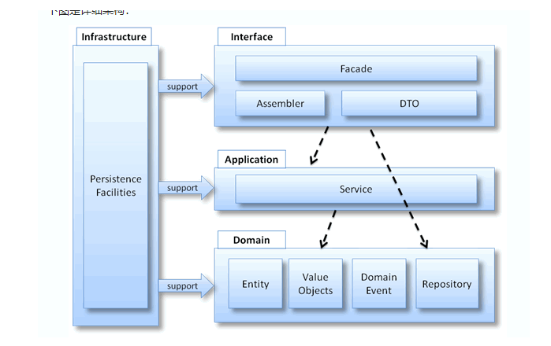
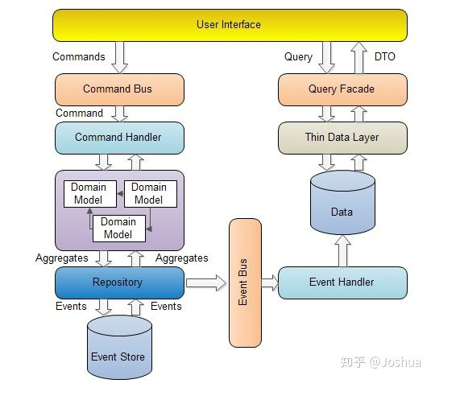
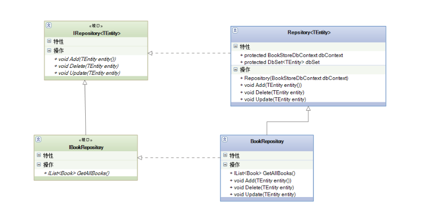

# 15. 心中有架构

XXLFramework.cs 提供了 MVC、分层、CQRS、事件驱动、数据驱动等工具，除了这些工具，XXLFramework.cs 还提供了架构使用规范。

而当使用 XXLFramework 熟练到一定的程度之后，就可以达到心中有架构的境界。

如果达到这个境界，你就早已不是当年的你了（开玩笑）。

心中有架构的境界，具体是指可以不依赖 XXLFramework.cs 就可以再项目中实践 XXLFramework.cs 架构。

具体的示例如下:

```csharp
using System;
using System.Collections.Generic;
using UnityEngine;

namespace XXLFramework.Example
{
    public class ArchitectureInHeartExample : MonoBehaviour
    {

        #region Framework

        public interface ICommand
        {
            void Execute();
        }

        public class BindableProperty<T>
        {
            private T mValue = default;

            public T Value
            {
                get => mValue;
                set
                {
                    if (mValue != null && mValue.Equals(value)) return;
                    mValue = value;
                    OnValueChanged?.Invoke(mValue);
                }
            }

            public event Action<T> OnValueChanged = _ => { };
        }

        #endregion


        #region 定义 Model

        public static class CounterModel
        {
            public static BindableProperty<int> Counter = new BindableProperty<int>()
            {
                Value = 0
            };
        }
        
        #endregion

        #region 定义 Command
        public struct IncreaseCountCommand : ICommand
        {
            public void Execute()
            {
                CounterModel.Counter.Value++;
            }
        }
        
        public struct DecreaseCountCommand : ICommand
        {
            public void Execute()
            {
                CounterModel.Counter.Value--;
            }
        }
        #endregion


        private void OnGUI()
        {
            if (GUILayout.Button("+"))
            {
                new IncreaseCountCommand().Execute();
            }

            GUILayout.Label(CounterModel.Counter.Value.ToString());

            if (GUILayout.Button("-"))
            {
                new DecreaseCountCommand().Execute();
            }
        }
    }
}
```

上图是一个计数器应用的实现。

在这个实现里，没有使用 XXLFramework.cs 里的任何内容，但是也写出来了符合 XXLFramework.cs 架构规范的计数器应用实现。

当大家使用 XXLFramework.cs 到一定程度之后，在未来不使用 XXLFramework.cs ，也可以按照 XXLFramework.cs 架构规范来写项目，而到此时，对于大家来说有没有 XXLFramework.cs 就无所谓了，因为 XXLFramework.cs 的架构规范已经刻在大家的骨子里了。


当大家熟练使用 XXLFramework.cs 之后，有一天如果大家去研究 网页前端、服务器、App 开发，会发现它们的很多框架与 XXLFramework.cs 架构有共通之处，甚至说，通过 XXLFramework.cs 中积累的开发经验可以直接照搬到其他领域的开发中。

这是因为 XXLFramework.cs 最初的设计目的，就是为了糅合和简化大量其他领域的架构概念，比如 React 中的 Redux（Flux）、.Net Core 开发中的领域驱动设计、CQRS、仓储模式等、App 开发中的 MVC、MVP、MVVM 等。

我们简单看一下这些图，大家就清楚了。

首先是前端 React 中的 Redux 的工作流程，如下：


其中 React Components 对应的是 QFramework.cs  中的 Controller。

Action + Reducers 对应的是 QFramework.cs 中的 Command

Store 对应的是 QFramework.cs 中的 Model。

接着是领域驱动设计：




其中 Interface 对应的是 IController。

Application 对应的是 ISystem。

Domain 对应的是 Model。

Infrustracture 对应的是 Utility + 一部分 Model。

接着看下 CQRS，CQRS 一般是领域驱动设计包含的模式，如下图所示:




其中 User Interface 对应的是 IController。

Command 和 Query 对应的是 Command 和 Query。

Domain Model 和 Data 对应的是 Model

Event 对应的是 Event。

非常接近。

接着看下仓储模式:




仓储模式没有具体的图，而此图是从网上随便找的，很清晰地表达出了仓储模式的结构。

其中 IRepository 对应的是 IModel。

Repository 对应的是 AbstractModel。

IBookRepository 对应的是 ICounterModel。

BookRespository 对应的是 CounterModel。

使用 ICounterModel 和 CounterModel 举例不是很合适，因为 CounterModel 只有一个 Counter 数据。

更适合的举例是 IStudentModel，StudentModel ，因为 StudentModel 会维护一个 Student 的 List。

仓储模式的优势在于，可以让上层（System、Controller）专注于数据的增删改查功能，而不是具体的增删改查实现，因为在服务器端，数据都是存储在数据库中的，数据库有很多类型，比如 MySQL、MongoDB 等，而在服务器端开发时，很有可能在开发阶段用 SQLite 或者 MongoDB，而在生产环境用的是 MySQL、PostgreSQL，所以在静态类型语言中，仓储模式会和 ORM 一起配合，让开发者专注在数据的增删改查和数据之间的关联上，而不是具体的查询语句，这样能提高开发效率。


最后，MVC、MVP、MVVM 这里就不介绍了，其中 MVP 和 MVVM 的实现会用 BindableProperty，有的会用反射的形式实现。

而 XXLFramework.cs 中的 BindableProperty 和 MVC 分层，则是来自这些架构中。

好了，此篇的内容就说完了。


