# 02. CodeGenKit 脚本生成

在这一篇，我们学习几乎每个项目都要用到并且从中受益的功能：自动生成脚本并绑定，简称脚本生成。

## 基本使用

我们先在场景中，随便创建一些有父子结构的 GameObject，如下所示：

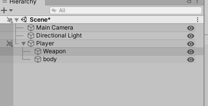

接着给 Player 挂上 ViewController，快捷键 （Alt + V），如下图所示：

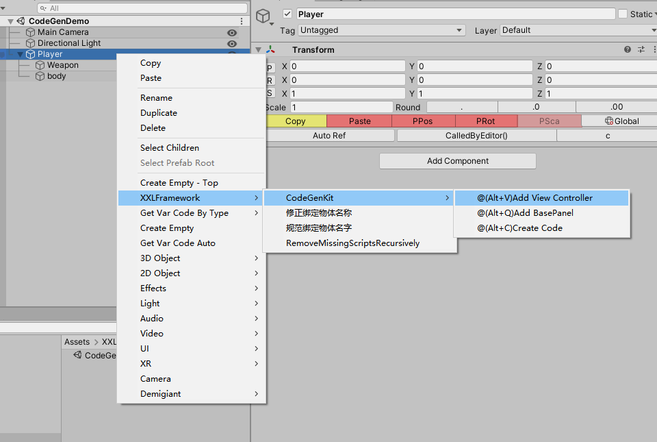


然后填写 刚刚添加的组件信息:

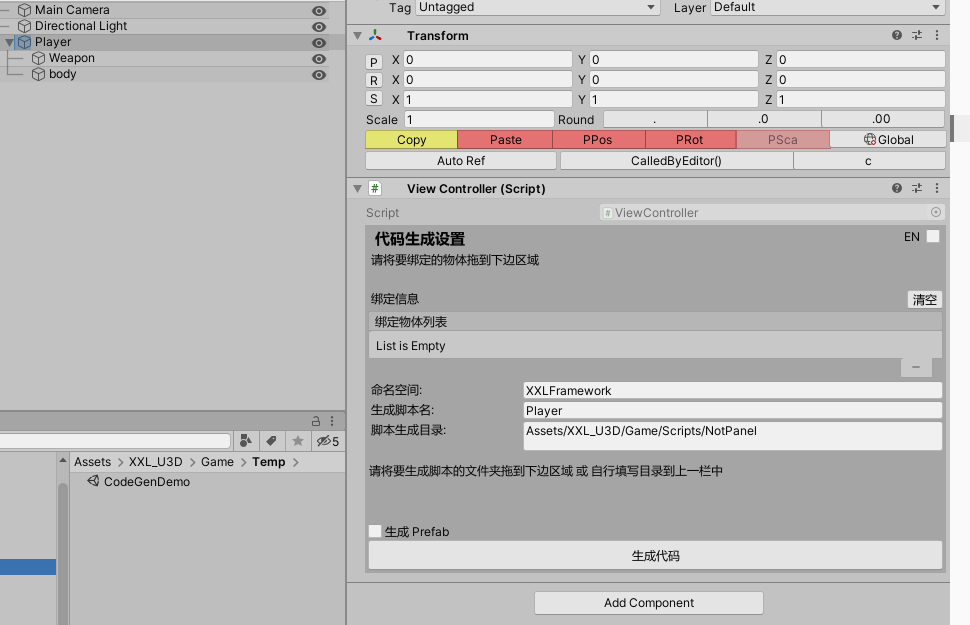


在这里，可以填写命名空间，要生成的脚本名，以及脚本生成的目录，当然这里也可以直接将要生成的目录拖到大方块中。

如果拖拽了目录，就会自动填写脚本生成目录，如下图所示：

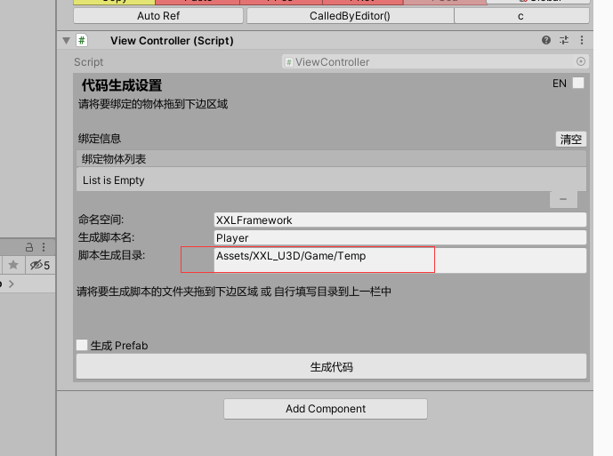

将需要绑定的子物体(**必须是它下面的子物体，否则生成的时候会找不到而报错**)拖到对应区域

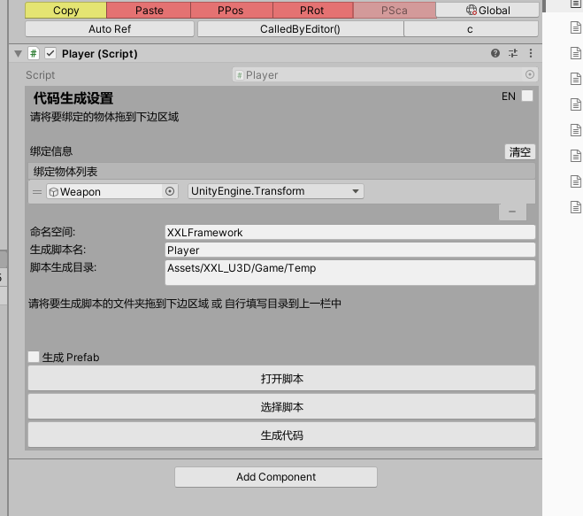

点击生成代码

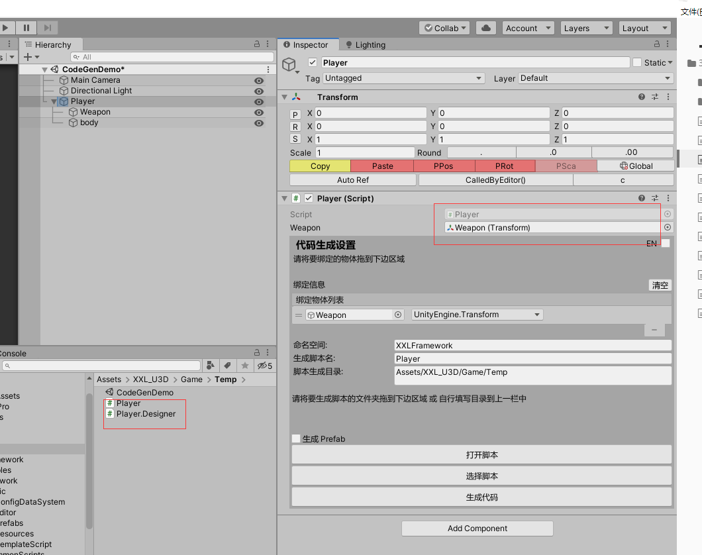


## 增量生成
我们再看下目录：

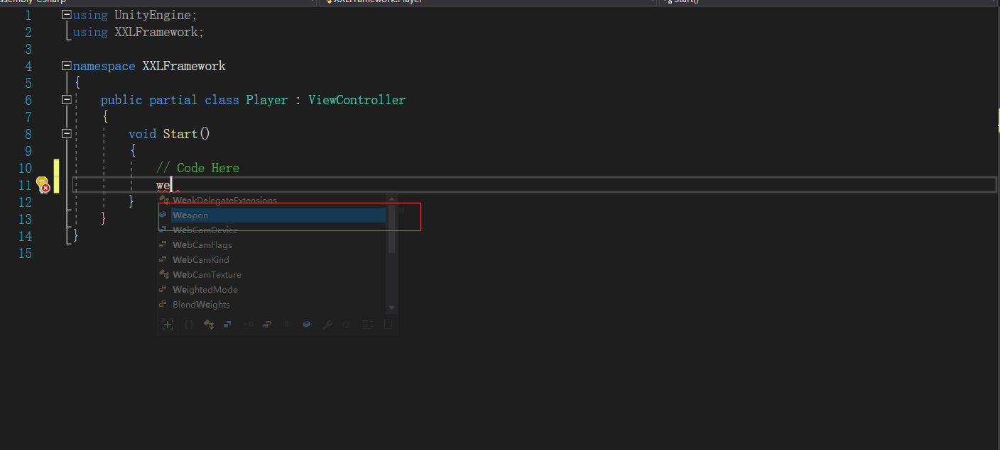

这里有两个文件 Player 和 Player.Designer。

其中 Player 是用来给大家写逻辑用的，所以 Player 只会生成一次。

而 Player.Designer 每次点击生成代码都会重新生成。

我们看下 Player.Designer 的代码，如下:

```csharp
// Generate Id:7588391f-fadb-4bcc-9cd1-537043ff0b1b
using UnityEngine;

namespace XXLFramework
{
	public partial class Player
	{

		public Transform Weapon;

	}
}

```

代码中只有一个 Weapon 。

接着，我们再将 Player 的另一个子 物体拖入绑定区域，点击生成

生成之后，结果如下:

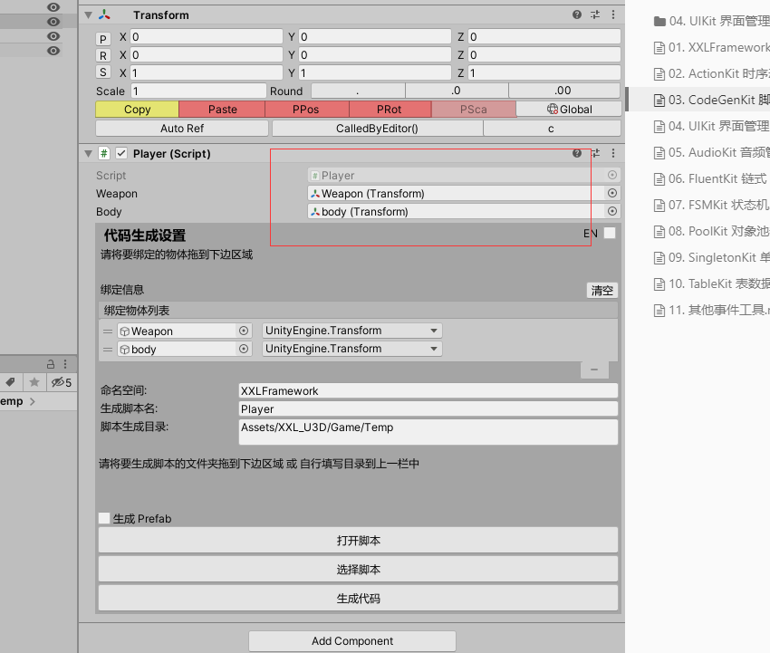

Player 多了一个 body

再看下  Player.Designer 的代码，如下:

```csharp
// Generate Id:9f3a1ded-6faa-4c78-88f7-ab1c653b5327
using UnityEngine;

namespace XXLFramework
{
	public partial class Player
	{

		public Transform Weapon;

		public Transform body;

	}
}

```

这次多了一个 body。

而 Player 代码则未发生任何变化。

所以每次生成代码，Player.cs 只会生成一次，Player.Designer.cs 每次都重新生成，所以大家放心在 Player.cs 里写代码。

## 类型选择
之前我们用 Bind 绑定的 GameObject 都是 Transform 类型的，这次我们尝试绑定一下其他类型。

我们选择 Sprite Render 类型，如下:

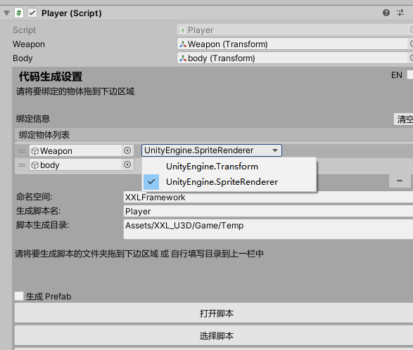

然后点击生成代码，结果如下:

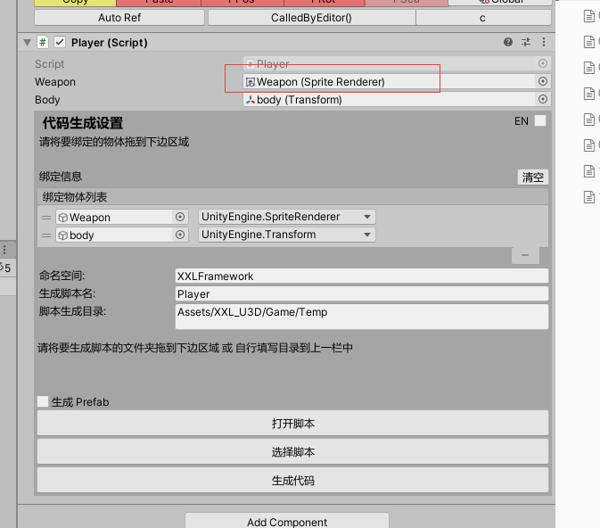


Player 引用的  Weapon 变成了 Sprite Renderer 类型。

Player.Designer.cs 的代码变成了如下:

```csharp
// Generate Id:e03287bb-b17f-458d-8f66-080d3ced2118
using UnityEngine;

namespace XXLFramework
{
	public partial class Player
	{

		public UnityEngine.SpriteRenderer Weapon;

		public Transform body;

	}
}

```

Weapon 从原来的 Transform 类型变成了 SpriteRenderer 类型。

## 如何设置默认的 命名空间 和 脚本生成目录
很简单，打开 XXLFramework 编辑器面板，（快捷键 ctrl + e)

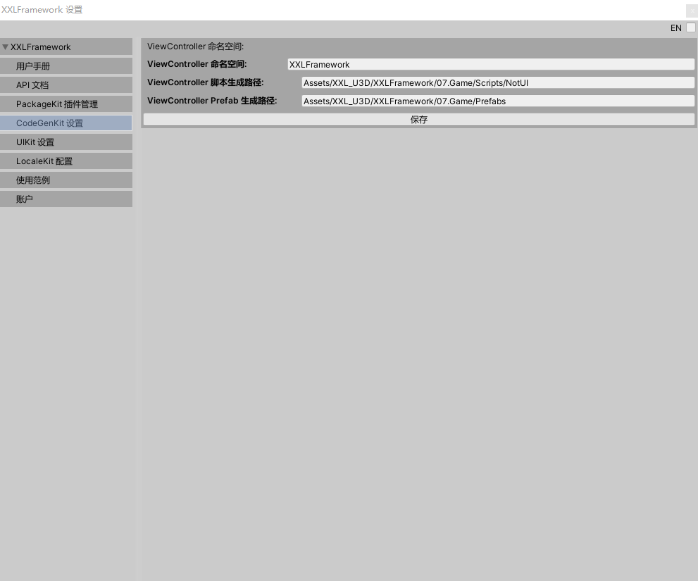

在 CodeGenKit 设置里就可以更改默认的命名空间和默认的脚本生成位置。

在 ViewController 或 生成脚本的 Inspector 上，有一个生成 prefab 的选项

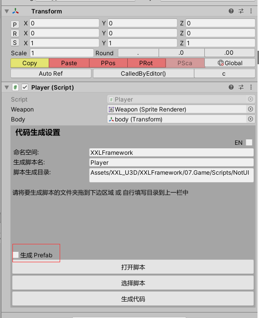

勾选后，如下所示：

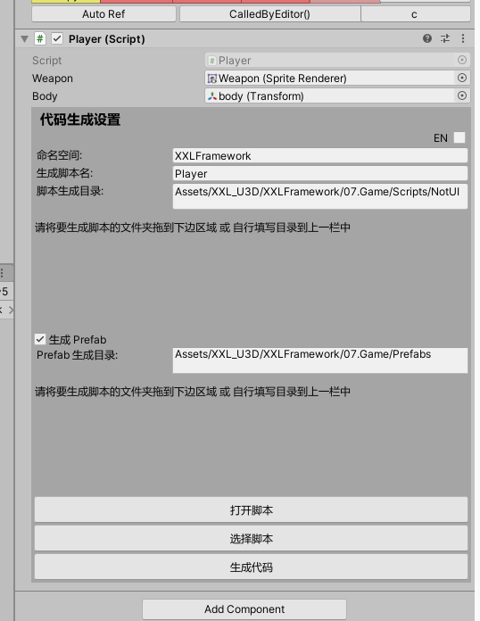

这里可以修改要生成的目录，如下:

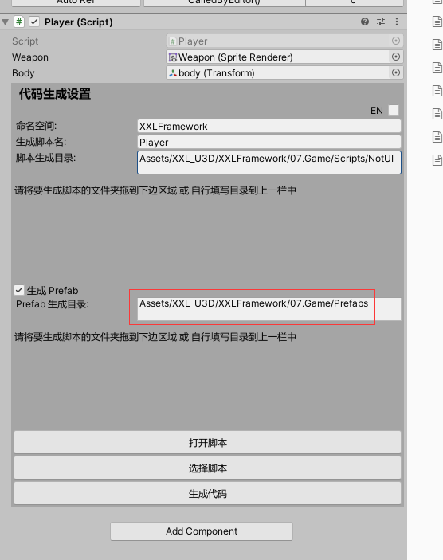

场景中的 Player 变成了 prefab,生成目录中也有prefab
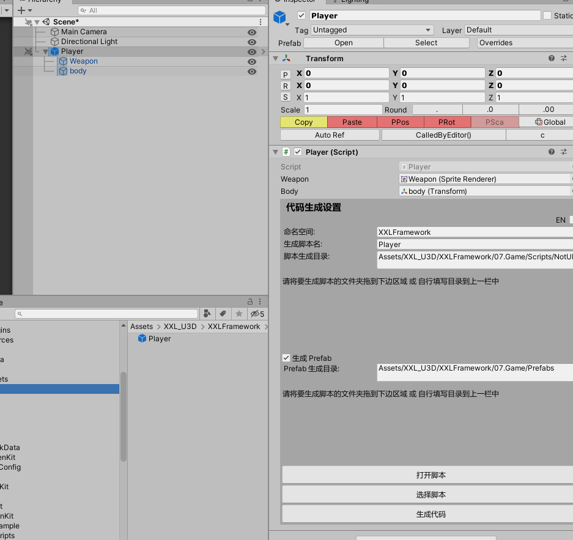

## Why？
为什么要搞一个  CodeGenKit？

因为创建脚本目录、创建脚本文件、声明成员变量或者通过 transform.Find 获取子节点的引用、然后挂脚本、拖拽赋值，这些工作量非常多，而且很繁重，如果能够把这部分工作量通过代码生成并自动赋值的方式给优化掉，那么项目的开发效率就会得到及大地提升。

CodeGenKit 中的  ViewController 除了可以用于普通的 GameObject，还可以支持 NGUI 和 UGUI 等 UI 组件。

好了，关于脚本生成的功能介绍到这里。

