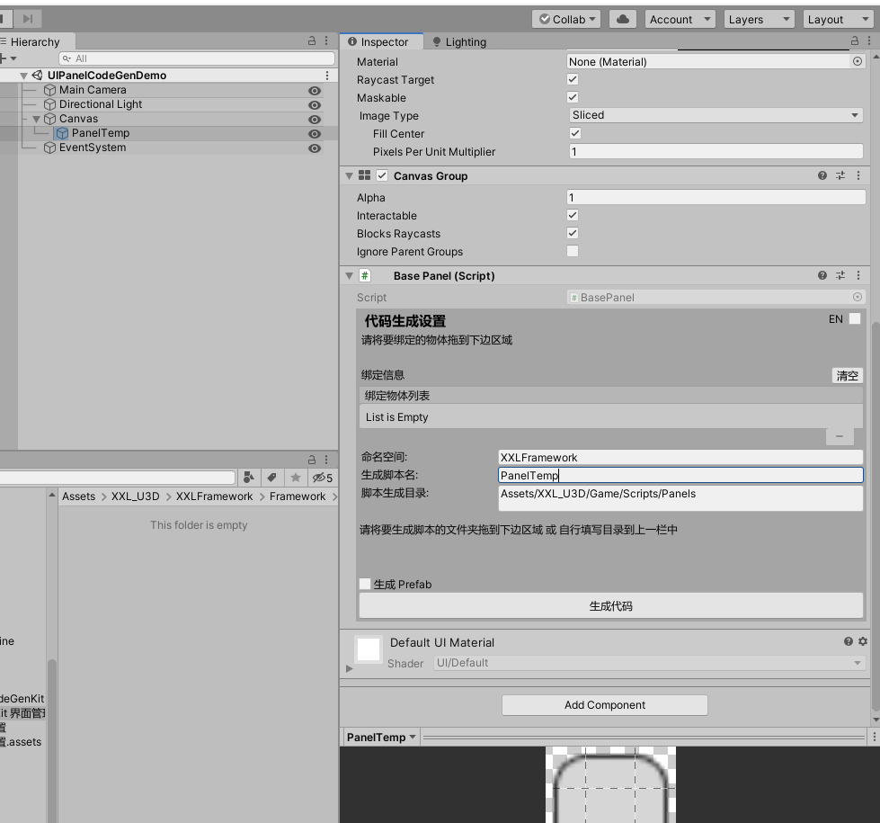
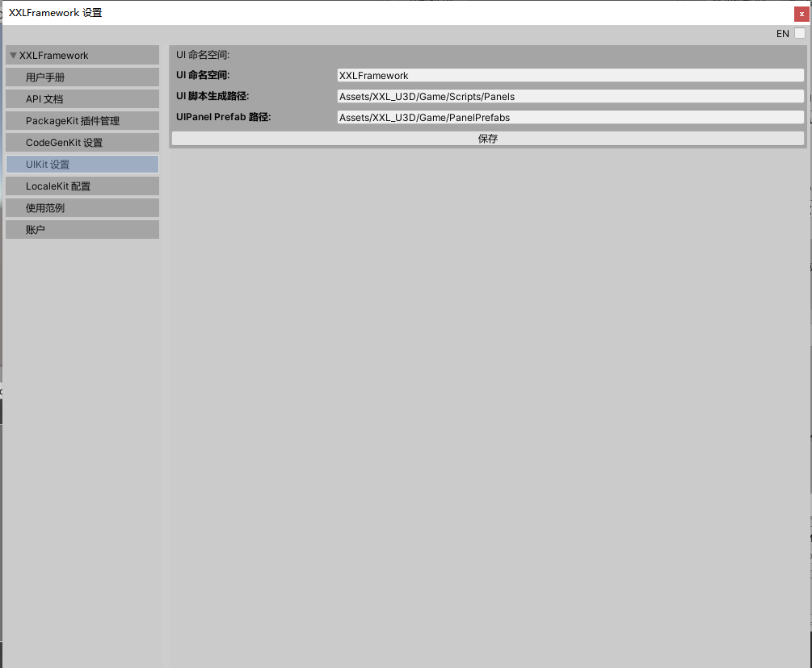
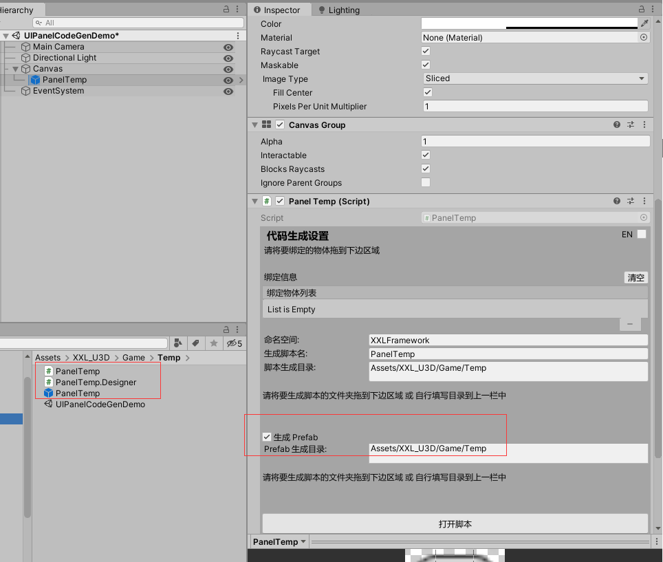
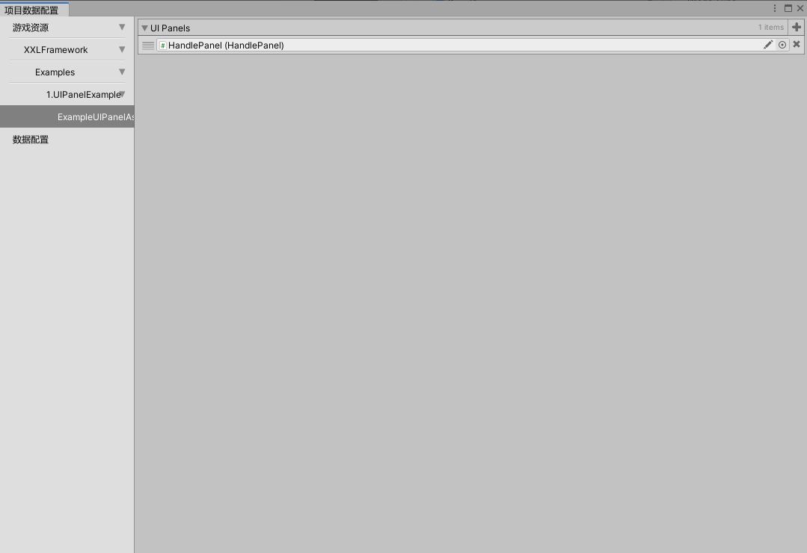

# 04. UIKit 界面管理&快速开发解决方案

## UI Kit 简介

UI Kit 是一套界面管理&快速开发解决方案

UI Kit 的特性如下：

* 界面管理
* 层级管理
* 代码生成及组件自动绑定（底层用的 ViewController)


## UI Kit 基本使用

选中一个Panel,在面板上添加BasePanel或者按住Alt+Q会自动添加BasePanel脚本



在Inspector面板中可以设置panel生成的命名空间，生成脚本名，脚本生成目录，是否生成Prefab及prefab的路径，默认路径可以打开XXLFramework/Preference或者按钮Ctrl+E打开容器在UIKit下设置



设置路径完成后点击【生成代码】，点击之后等待编译，编译结束后，我们看到如下结果，如果勾选生成Prefab，则会在指定位置生成prefab




## 控件的自动绑定功能和CodeGenKit上的用法一致，因此不作赘述。


## 打开、关闭界面

真正打开一个 UI 界面，是通过 UIKit.OpenPanel 这个 API 完成的。

只需要写如下代码即可:

```csharp
UIKit.OpenPanel<TestPanelA>();
```

代码非常简单。

而我们要关闭掉一个 UI 界面也比较容易，代码如下:

```csharp
UIKit.ClosePanel<TestPanelA>();
```

如果是在一个界面内部关掉自己的话，代码如下:

```csharp
this.CloseSelf(); // this 继承自 BasePanel 
```

OK，到此我们接触了 3 个 API：

* UIKit.OpenPanel\<T\>();
* UIKit.ClosePanel\<T\>();
* UIPanel.CloseSelf();

后边的两个没什么好讲的，很简单，但是第一个 API 比较重要，因为它有一些参数我们可以填。

## UIKit.OpenPanel

UIKit.OpenPanel 的参数定义及重载如下：

```csharp
public static void OpenPanel<T>(PanelLevel level = PanelLevel.Common, IPanelData uiData = null,
			string gameObjName = null) where T : BasePanel
{
	...
}
```


所有参数如下：

* PanelLevel：界面在哪个层级打开
  * 默认值：Common
* uiData：打开时可以给界面传的初始数据
  * 默认值：null
* gameObjName：如果界面中有同类名的panel,则用名字将它们区分去判断打开哪个
  * 默认值：null

都有默认值，所以这四个参数都可以不用传。

有的童鞋可能会问，我们给 UIHomePanel 传递的  UIHomePanelData，在哪里使用呢？

答案是在，OnInit 和 OnOpen 中，如下所示:

```csharp
namespace XXLFramework.Example
{
    using System;
    using System.Collections;
    using System.Collections.Generic;
    using System.Linq;
    using UnityEngine;
    using UnityEngine.UI;
    
    
    public class UIBasicPanelData : BasePanelData
    {
        public int Coin;
    }
    
    public partial class UIBasicPanel : BasePanel
    {
        protected override void OnInit(QFramework.IUIData uiData)
        {
            mData = uiData as UIBasicPanelData ?? new UIBasicPanelData();
            // please add init code here
            
            // 外边传进来的，第一次初始化的时候使用
            Debug.Log(mData.Coin);
        }
        
        protected override void OnOpen(QFramework.IUIData uiData)
        {
            // 每次 OpenPanel 的时候使用
            Debug.Log((uiData as UIBasicPanelData).Coin);
        }
        
        protected override void OnClose(bool destroy)
        {
        }
    }
}

```

为什么要这样做呢？

界面有两种显示数据的用法，一种是有的界面是需要从外边填充的，比如警告、弹框、或者道具信息页面等。另一种界面是需要自己获取数据并展示的，比如游戏中的主角金币、等级、经验值等。

如果界面的数据都从外边填充，那么这个界面会拥有更好的可复用性。

当然需要一个可复用性的界面还是需要一个普通界面就看大家的需求了，并不是说有可复用性的界面就是好的。


## UIPanel 生命周期

我们先看下  UIBasicPanel 的代码，如下:

```csharp
namespace XXLFramework.Example
{
    using System;
    using System.Collections;
    using System.Collections.Generic;
    using System.Linq;
    using UnityEngine;
    using UnityEngine.UI;
    
    
    public class UIBasicPanelData : BasePanelData
    {
    }
    
    public partial class UIBasicPanel : BasePanel
    {        
        protected override void OnInit(QFramework.IUIData uiData)
        {
            mData = uiData as UIBasicPanelData ?? new UIBasicPanelData();
            // please add init code here
            
            
        }
        
        protected override void OnOpen(QFramework.IUIData uiData)
        {
        }
        
        protected override void OnClose(bool destroy)
        {
        }
    }
}
```

默认的生命周期函数如下:

* OnInit
* OnOpen
* OnClose

OnInit 则是在 UIPanel 所在的 prefab 初始化的时候进行调用的，在调用 UIKit.OpenPanel 时，只要在 UIKit 中没有对应的缓存界面时，就会调用一次 OnInit 这个周期。

OnOpen 就是每次 UIKit.OpenPanel 调用时，就会调用。

最后 OnClose 就是在 UIKit.ClosePanel 调用时，就会触发，如果destroy参数为false,则只是隐藏面板，如果为true,则销毁面板，相当于 OnDestory 这个周期。

OK，此篇的内容就这些。


## UIKit 剩下的常用 API

不同Container之间相当于两套不同的系统，管理各自下面的Panel, 不同容器之间可以互相切换而互不影响容器内部逻辑，平时的项目用一个默认的Container就足够了

### UIKit.AddContainer(PanelContainer container); 

### UIkit.RemoveContainer<T>(); 

### UIkit.ChangeContainer<T>();

管理容器的一些方法，

有的时候，UI 需要实现一个 UI 界面的堆栈，以便于支持返回上一页这样的操作。

这个时候就可以用 PushPanel 和 UIkit.Back 实现。

示例代码:

```csharp
BasePanel panel = UIKit.OPenPanel<UIHomePanel>();
UIKit.PushPanel(panel);      
UIKit.Back(); // 弹出当前堆栈界面
```

* 一般情况下只使用一个PanelContainer就能满足需求，如果遇到需要使用多个容器的时候，那么可以写一个容器继承自PanelContainer,加到UIManager中。

# UI 资源加载

打开XXLFramework/GameConfig可以打开游戏资源配置面板，在UIPanelAssets里可以配置一些公用的Panel资源，调用UIKit.OpenPanel()时，如果在Scene场景中找不到该面板，则会统一从UIPanelAssets中去加载资源，以此方式来替代Resources加载的方法，比较直观，在资源配置中只添加项目中用到的资源，其他未用到的资源就不会打进包里。



## UI Kit 小结

在这一章，UI Kit 的核心功能，我们都接触过了，如下：

* UIPanel/UIElement 代码生成
* UIKit 常用 API
  * UIKit.OpenPanel
  * UIKit.ClosePanel
  * UIKit.PushPanel
  * Uikit.Back
* UIPanel 生命周期

只要掌握了以上这些，基本上开发一些界面就没啥问题了。

关于 UIKit 就介绍到这里。


  