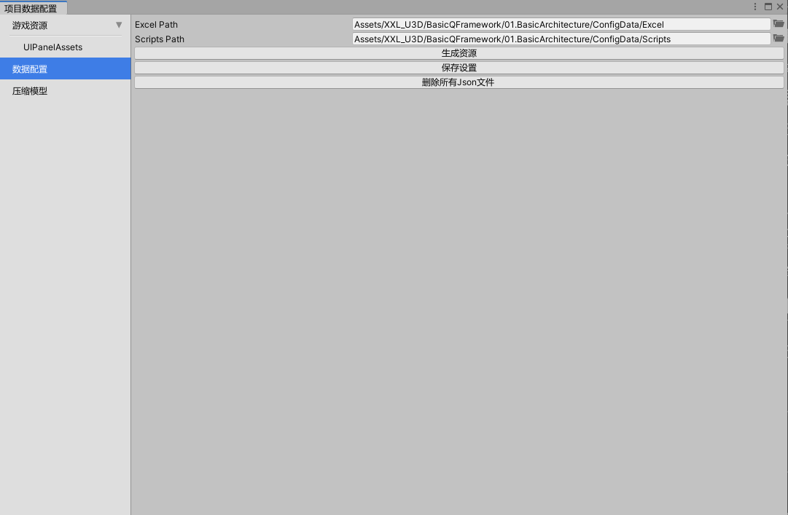
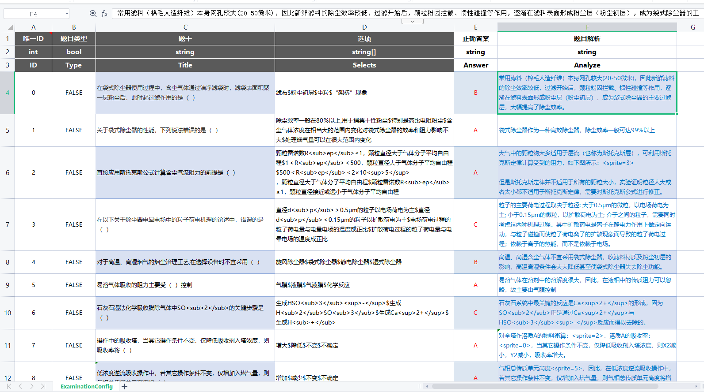
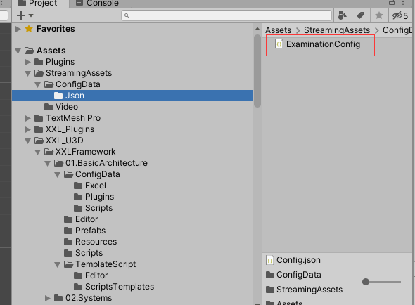
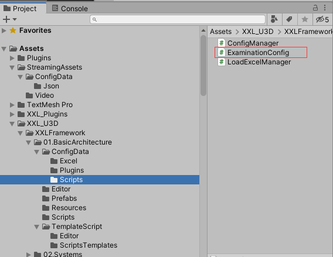
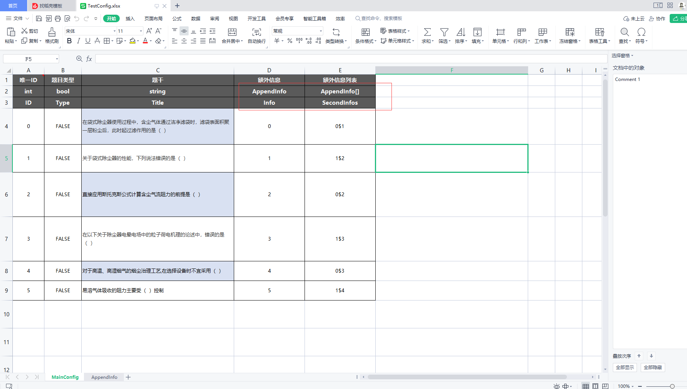
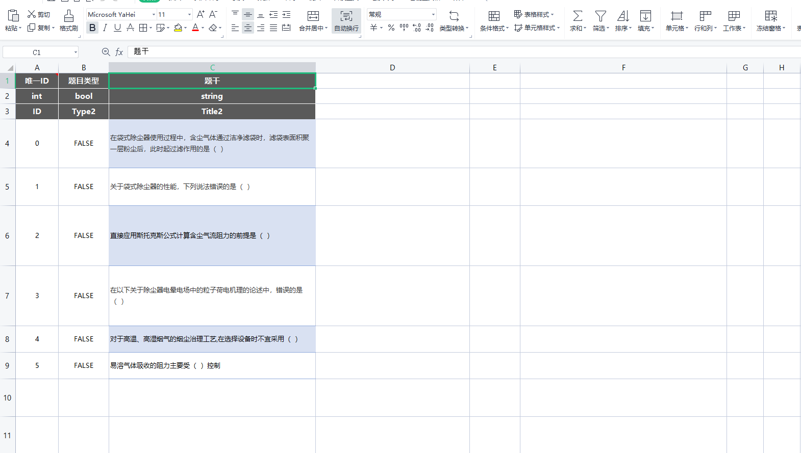
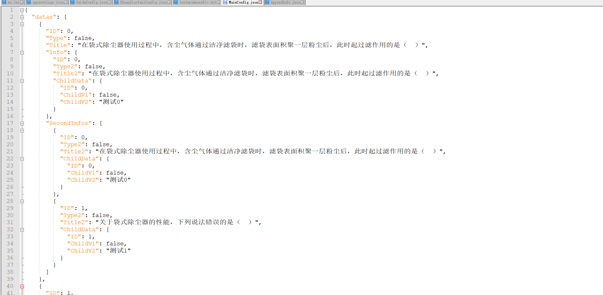

# 数据配置和使用说明

## 根据Excel表格生成对应的Json数据和对应的类。

# 使用流程：

## 1、点击菜单[XXLFramework/GameConfig打开窗口,切到数据配置窗口，右侧可以配置表格路径和生成脚本路径

## 2、表格样式

下方的表格名为生成的类名

第一行:注释，第二行:数据类型(int,string,bool,float, int[], float[], string[], bool[])共8种类型，第三行：变量名;

数组类型用$分隔符

# 3、生成Json和对应的脚本文件

点击生成后会在StreamingAssets/ConfigData/Json生成对应的Json文件和脚本生成文件夹下生成对应的类文件

## 4、使用示例

ExaminationConfig.Init(LoadConfig);

## 5、支持类中套类(可以无限套娃)和子类列表

上图为生成的json截图